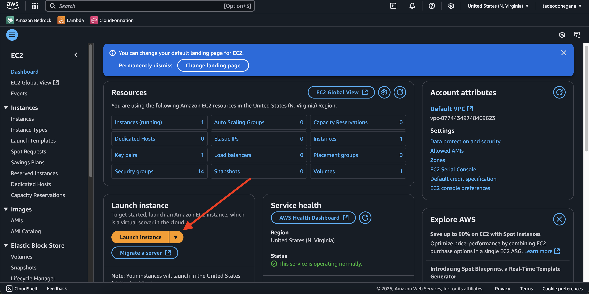
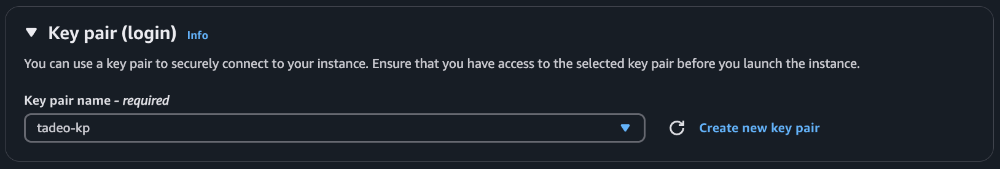
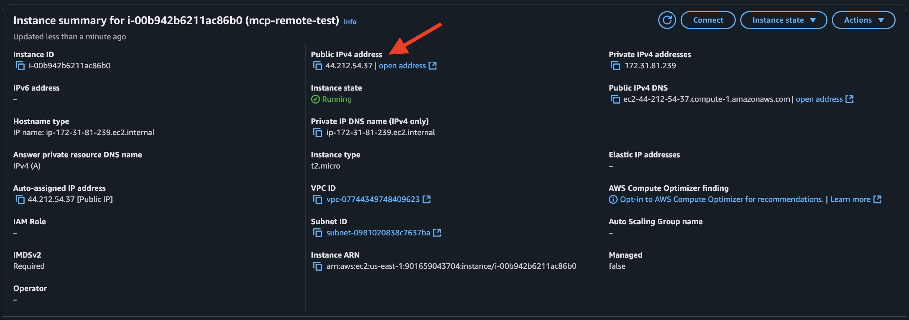

## Introduction

Model Context Protocol (MCP) servers are rapidly gaining popularity—and for good reason. Since their launch by Anthropic [last November](https://www.anthropic.com/news/model-context-protocol), numerous cool MCP servers have emerged, enabling Large Language Models (LLMs) to seamlessly connect with external tools, data sources, and custom logic, greatly enhancing their contextual understanding and capabilities.

While self-hosting MCP servers is an excellent option for developers, it can present a significant barrier to entry for individuals. To address this, platforms like **Smithery**—which we covered in our previous post, [MCP with Cursor: Improve development productivity](https://tadeodonegana.com/posts/how-to-add-mcp-server-cursor/)—offer easy-to-use registries of hosted MCP servers.

However, for organizations needing greater control and security over their MCP lifecycle, hosting an MCP server on private infrastructure becomes crucial.


Having your own MCP deployment grants you security, compliance, and full lifecycle control—key requirements for enterprise scenarios.

In this post, we’ll walk through deploying a **Model Context Protocol server** on an Amazon Web Services EC2 instance—one of the most widely used cloud computing platforms globally.

Before diving into deployment, let's first review how MCP utilizes Server-Sent Events (SSE) for remote communication.

## Understanding Server-Sent Events (SSE) with MCP

The Model Context Protocol supports two transport mechanisms:

- **Standard Input/Output (STDIO)**: For local communication.
- **Server-Sent Events (SSE)**: For remote communication between different networks.

When hosting remotely, SSE is preferred. Clients initiate HTTP POST requests, and the server streams back responses, maintaining a long-lived connection to send ongoing updates.

We will discuss more about SSE, STDIO, and the recently introduced HTTP transport option in future posts.

## Hosting an MCP Server on AWS EC2

For our example, we'll use AWS EC2, that offers the broadest and deepest compute platform, with over 750 instances to choose from. The general approach outlined here applies similarly to platforms like **DigitalOcean**, **Heroku**, **Render** and many more.

### 1. Building the MCP Server

Here's a simple Node.js MCP server leveraging the Serper API for web search capabilities:

```javascript
import express, { Request, Response } from "express";
import { McpServer } from "@modelcontextprotocol/sdk/server/mcp.js";
import { SSEServerTransport } from "@modelcontextprotocol/sdk/server/sse.js";
import axios from "axios";
import { z } from "zod";

// Create an MCP server
const server = new McpServer({
  name: "test-remote-server",
  version: "1.0.0"
});

// Store API keys per session
const sessionApiKeys: { [sessionId: string]: string } = {};

// Register web search tool
server.tool(
  "search_web",
  "Search the web for the given query",
  { query: z.string().describe("The search query to look up on the web") },
  async (args, extra) => {
    try {
      // Get sessionId from extra context
      const sessionId = extra.sessionId as string;

      if (!sessionId) {
        console.error("ERROR: Could not determine sessionId for the request.");
        return {
          content: [{ type: "text", text: "Error: Internal server error (missing session ID)." }]
        };
      }

      // Retrieve the API key stored for this session
      const apiKey = sessionApiKeys[sessionId];

      // Check if the API key exists for this session *before* attempting to use it
      if (!apiKey) {
        console.error(`ERROR: API key not found for session ${sessionId} when attempting tool use.`);
        return {
          content: [{ type: "text", text: "Error: API key not configured for this session. Please ensure X-Serper-Api-Key header was sent on connection." }]
        };
      }

      // Call Serper API using the session-specific key
      const response = await axios.post(
        "https://google.serper.dev/search",
        { q: args.query, num: 3 }, // Search for query and limit to 3 results
        {
          headers: {
            "X-API-KEY": apiKey, // Use the retrieved apiKey here
            "Content-Type": "application/json"
          }
        }
      );

      // Create a simple text report of search results
      let resultText = `Search results for: ${args.query}\n\n`;

      // Add web results
      if (response.data.organic) {
        resultText += "Web Results:\n";
        response.data.organic.forEach((result: any, index: number) => {
          resultText += `${index + 1}. ${result.title}\n`;
          resultText += `   ${result.link}\n`;
          resultText += `   ${result.snippet}\n\n`;
        });
      }

      // Return the results as text content
      return {
        content: [{ type: "text", text: resultText }]
      };
    } catch (error) {
      return {
        content: [{ type: "text", text: "Error: Could not complete the search." }]
      };
    }
  }
);

// Express + SSE setup
const app = express();
const transports: { [sessionId: string]: SSEServerTransport } = {};

app.get("/sse", async (req: Request, res: Response) => {
  // Extract API key from header
  const apiKey = req.headers['x-serper-api-key'] as string;

  const transport = new SSEServerTransport("/messages", res);
  transports[transport.sessionId] = transport;
  // Store the provided API key (or empty string if missing) for this session
  sessionApiKeys[transport.sessionId] = apiKey || "";

  console.log(`SSE session started: ${transport.sessionId}`);

  res.on("close", () => {
    console.log(" SSE session closed:", transport.sessionId);
    delete transports[transport.sessionId];
    delete sessionApiKeys[transport.sessionId]; // Clean up API key on disconnect
  });

  await server.connect(transport);
});

app.post("/messages", async (req: Request, res: Response) => {
  const sessionId = req.query.sessionId as string;
  const transport = transports[sessionId];

  if (transport) {
    await transport.handlePostMessage(req, res);
  } else {
    res.status(400).send("No transport found for sessionId");
  }
});

const PORT = process.env.PORT || 3000;

app.listen(PORT, () => {
  console.log(`MCP Server running on port ${PORT}`);
});
```

This example creates two key endpoints:

- `/sse`: Establishes SSE connections.
- `/messages`: Handles client messages and server responses.

**Full code available** on [GitHub](https://github.com/tadeodonegana/remote-mcp-host-ec2)

### 2. Deploying MCP Server to AWS EC2

Follow these steps to launch your MCP server:

#### Create an EC2 instance

- Launch a new EC2 Instance via the EC2 Dashboard
  
- Choose Ubuntu AMI and a `t2.micro` instance.
  
- Generate or select an existing key pair.
  

#### Connect and setup dependencies

SSH into your instance:

```sh
ssh -i "your-key.pem" ubuntu@[your-ec2-address]
```


Make sure you used the chmod 400 command to update access on the certificate.

Install Node.js:

```sh
sudo apt-get install curl
curl -sL https://deb.nodesource.com/setup_18.x | sudo -E bash -
sudo apt-get install nodejs
```

Clone and deploy your MCP server:

```sh
git clone https://github.com/tadeodonegana/remote-mcp-host-ec2.git
cd remote-mcp-host-ec2
npm install
npm run build
npm start
```

Here, many other options are available, like uploading the code from your local machine manually or using a CI/CD pipeline, dockerizing the content and uploading it to ECR, for example.

#### Configure security group

Open port `3000` in your instance's security group to enable external access.

> Right click + Open image in new tab for full resolution


Note your EC2 Public IPv4 address:



## 3. Testing Remote MCP Server

We'll use Claude Desktop as the client for testing. Update `claude_desktop_config.json`:

```json
{
	"mcpServers": {
		"searchMCP": {
			"command": "npx",
			"args": [
				"mcp-remote",
				"http://[your-ec2-ip]:3000/sse",
				"--allow-http",
				"--header",
				"X-Serper-Api-Key:[YOUR_SERPER_API_KEY]"
			]
		}
	}
}
```

For this particular implementation, we are using [`mcp-remote`](https://www.npmjs.com/package/mcp-remote), an npm package designed to connect MCP clients—which originally support only local communication (via STDIO)—to remote MCP servers using SSE, including support for authentication headers.

In our configuration, we pass the API key through a custom HTTP header (`X-Serper-Api-Key`). This approach is necessary because each client connection requires a unique credential, making environment variables unsuitable for authentication in remote SSE setups.

It's important to note that, at the time of writing, MCP does not natively support authentication methods. Therefore, using custom HTTP headers is a practical workaround but might pose security risks in production environments. We will cover these security considerations more thoroughly in a later section of this post.

Replace `[your-ec2-ip]` and `[YOUR_SERPER_API_KEY]`.

You can get a free Serper API [here](https://serper.dev/).

Now, Claude should recognize the MCP server and respond appropriately to tool requests.

Let's try with the prompt: "Search the web for Tandil, Buenos Aires"


## Pros and Cons of SSE

SSE just works, but is it good enough for production in complex environments?

**Pros:**

- Easy setup and quick deployment.
- Real-time, bidirectional communication.

**Cons:**

- Occasional connection drops.
- Difficult scalability (connection bottlenecks).
- Firewall restrictions.
- Troubleshooting challenges.

If you are building an small project SSE is your way to go, but consider other alternatives if you are planning to deploy something to production.

## Security Considerations

MCP security remains critical, with noted risks including:

- **Command Injection:** An attacker could inject malicious commands into our remote instance.
- **Tool Poisoning:** Hides malicious instructions inside the MCP tool’s description, invisible to the user.
- **Silent Tool Redefinition ("Rug Pull"):** When installing an MCP tool, they can can mutate their own definitions after installation. You approve a safe-looking tool on Day 1, and by Day 7 it’s quietly rerouted your API keys to an attacker.

We'll explore these concerns in greater detail in future posts. Always maintain robust security standards when deploying MCP solutions, specially in production.

## Conclusion

Deploying your own MCP server provides significant flexibility and control, especially important for enterprise security and customization needs. AWS EC2 offers a straightforward and reliable solution to host MCP servers remotely, facilitating advanced interactions between LLMs and external data sources.

Special thanks to the **LLM-Native BA community** ([Join Us!](https://discord.gg/dNbBa9xM)), **Lauti Gesuelli** for continued MCP insights, and **Lando** for his support during this deployment.

Stay tuned for more posts exploring MCP security, authorization, and advanced integration techniques!
