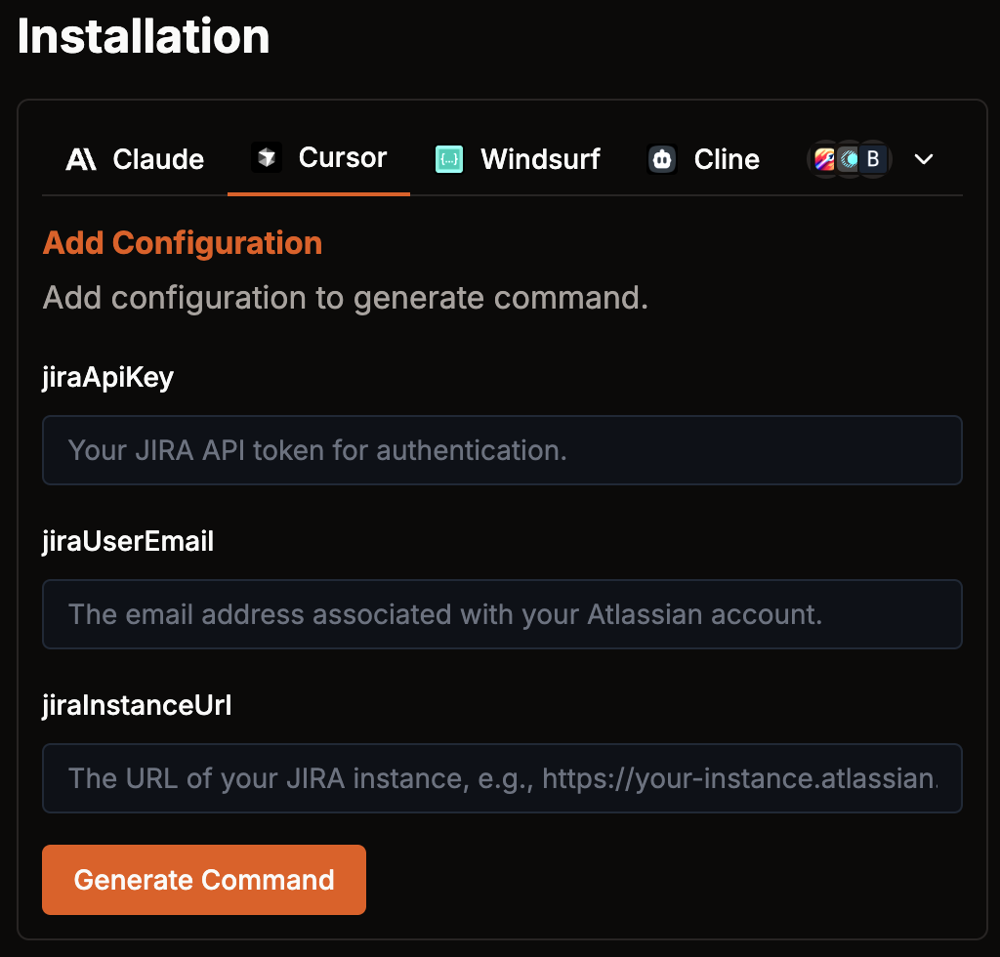
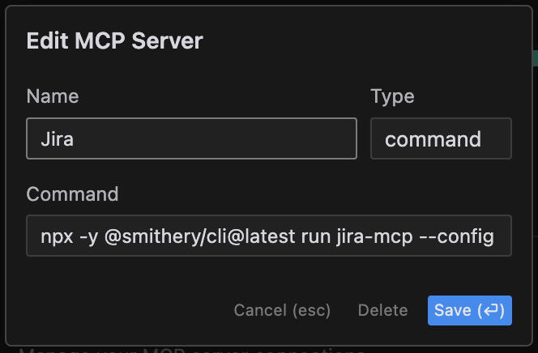

## Introduction

In this blog post, I will explore how to integrate the **Model Context Protocol (MCP) with Cursor** to enhance developer productivity. [MCP](https://www.anthropic.com/news/model-context-protocol) is an open protocol designed by Anthropic to structure interactions between AI models and external systems easily. It allows models to access structured context efficiently and dynamically retrieve relevant information from specific external systems. In this post, we will leverage **Smithery** to obtain a ready-made MCP Jira server to integrate it into Cursor, in order to automatically implement Jira tickets and improve the developer experience.

## What is MCP?

**Model Context Protocol (MCP)** is a protocol that standardizes how AI models communicate with external tools and data sources. It essentially allows you to provide custom tools or connectors to large language models in a structured way. With MCP, an AI model can seamlessly integrate with external systems (like APIs or databases) and pull in relevant context on demand. This means the model doesn't require all context to be manually provided in each prompt – it can fetch needed information as tasks evolve in an easy way. For more information about MCP, read Anthropic's [official post](https://www.anthropic.com/news/model-context-protocol) about its launch.

## Why use MCP with Cursor?

Cursor is an AI-powered IDE that enhances developer efficiency by providing intelligent code suggestions and context-aware capabilities. By integrating **MCP with Cursor**, we can unlock even more powerful features.

In this blog post, we will be developing a Jira MCP integration for Cursor, in order to automatically give Cursor context about assigned Jira tickets and their details, letting Cursor automatically implement fixes, changes, and whatever is described on the Jira ticket in question. This enables improved developer performance by letting Cursor handle the needed code implementation.

## Using Smithery: Easy set up for MCP servers

### What is Smithery?

[Smithery](https://smithery.ai/docs) is a platform that provides a registry of hosted MCP servers, simplifying the integration process. Instead of setting up an MCP server manually from scratch, we can leverage Smithery's ready-made solutions – for example, the **Jira-MCP server**. Smithery's Jira MCP server enables an LLM to interact with Jira through standardized tools (including JQL issue search and issue detail retrieval). In other words, it's a pre-built MCP connector for Jira that we can plug into Cursor. Alternatively, you can host an equivalent MCP server locally and reference it from Cursor, but using Smithery's hosted server is often more convenient in terms of speed of implementation, though not necessarily in terms of security and customization, so take this into account.

You can also search for other MCP-ready servers on the Smithery registry and try to include them in Cursor in the same way described in this blog post.

### Consuming an MCP Server via Smithery

To obtain and run the Jira MCP, you must customize the following command with your Jira credentials. You will need Node.js 18.0.0 or higher
and npm (usually included in Node.js installation) to use Smithery.

```sh
npx -y @smithery/cli@latest run jira-mcp --config "{\"jiraApiKey\":\"[JIRA_API_KEY]\",\"jiraUserEmail\":\"[YOUR_JIRA_MAIL]\",\"jiraInstanceUrl\":\"[YOUR_JIRA_INSTANCE_URL]\"}"
```

> You can obtain a Jira API key from [here](https://id.atlassian.com/manage-profile/security/api-tokens).

If you want to obtain an easier configuration of the startup command, you can go to the official [Smithery page](https://smithery.ai/server/jira-mcp) for the MCP server and complete the required fields. This will output the final command ready to copy and paste.



This command starts the Jira-MCP server (via Smithery's CLI). Once running, the server will listen for requests from Cursor and dynamically provide Jira data. Essentially, it acts as a bridge between Cursor and your Jira instance, allowing Cursor to access Jira ticket data on the fly. Alternatively, you can run the server locally with the same results; follow [Cursor docs](https://docs.cursor.com/context/model-context-protocol) in order to achieve this.

## Use an MCP server on Cursor: Jira implementation

After setting up the MCP server, the next step is to inform Cursor about it. Update Cursor's configuration to reference the new MCP endpoint.

To do this, go to Cursor Settings -> Features -> MCP Servers -> Add New MCP Server

Choose a descriptive name for the Jira MCP Server, choose type command and paste the generated command, as shown below:



If everything was set up correctly, a green dot should appear next to the just implemented MCP server, and a list of tools including `jql_search` and `get_issue` should be shown.

If any trouble is shown, please check your Jira credentials, or feel free to comment on this post to receive assistance.

With the Jira MCP integrated, we can now prompt Cursor (Chat or Composer) to utilize this new capability. For instance, you might ask Cursor's to pull in information from Jira and act on it. Here's an example prompt:

```text
Read my Jira tickets, specifically from a project called PLATFORM. Find tickets with the tag personal-web and implement them. My user is Tadeo Donegana Braunschweig.
```

This prompt instructs the AI agent to retrieve Jira issues from the *PLATFORM* project that are tagged *personal-web* (assigned to the user Tadeo Donegana Braunschweig), and then implement them. 

### Expected Output

Below, you can see a video under three minutes that shows the whole workflow of this implementation, from the prompt shown above to the blog post generation and the push of the changes to the remote repository. The entire process takes less than three minutes.

<iframe width="560" height="315" src="https://www.youtube.com/embed/v-aGrTd_JJo" title="MCP with Cursor Workflow" frameborder="0" allow="accelerometer; autoplay; clipboard-write; encrypted-media; gyroscope; picture-in-picture" allowfullscreen></iframe>

As you can see in the video, when you run the above prompt, the MCP server will leverage Jira's API to find the relevant tickets and feed their details into Cursor. In practice, this means Cursor's AI agent automatically receives the content of those Jira tickets as additional context for its code generation. The result is that Cursor can immediately suggest code implementations for the tasks described in your Jira tickets.

The result of the generated blog post is pretty accurate and follows the indications described on the Jira ticket. You can see the resulting pull request [here](https://github.com/tadeodonegana/tadeodonegana.github.io/pull/57).

### Current Limitations for this implementation

1. **Manual Context in Prompt** – Currently, you might still need to hint at context in the prompt (like specifying project name or user) because Cursor doesn't automatically know which project or user to query. This could be improved by storing default project identifiers or user info in configuration (for example, in a `.cursorrules` file) so that even those details need not be typed out each time.
2. **Detailed Jira Tickets Required** – The quality of the suggestions depends on the detail in your Jira tickets. If the tickets lack clear descriptions or acceptance criteria, the code suggestions might be generic or require more refinement. Essentially, garbage in, garbage out – so ensure your Jira issues are well-described to get the best results.

## Conclusion

Integrating **MCP with Cursor** unlocks powerful automation and productivity enhancements for developers. By leveraging **Smithery's hosted MCP servers** (or running your own), we can dynamically retrieve relevant information from external systems and incorporate it into our coding environment. In our example, Jira issue context is pulled in automatically, but this is just one use-case – the possibilities with MCP are broad.

For more details, visit the [Cursor documentation](https://docs.cursor.com/context/model-context-protocol) on MCP and context integration.