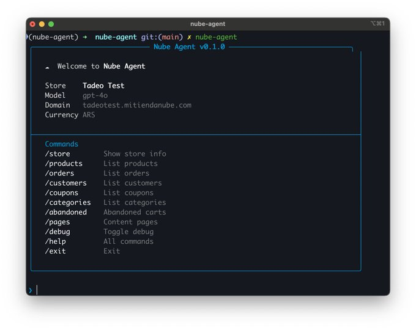
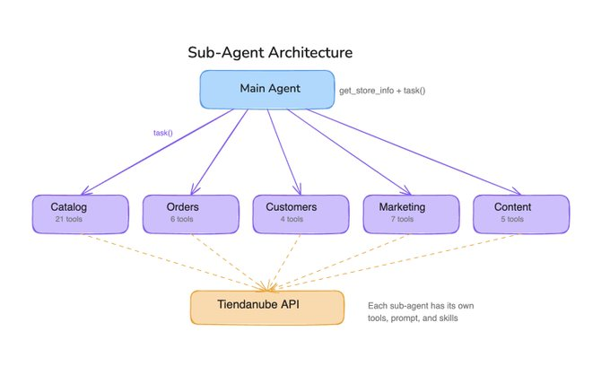
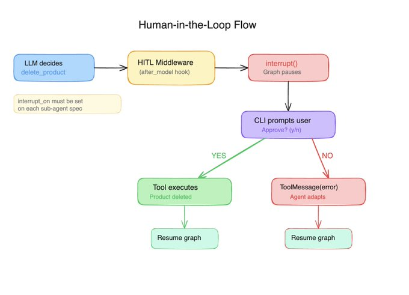
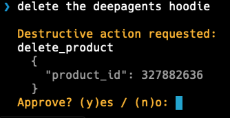
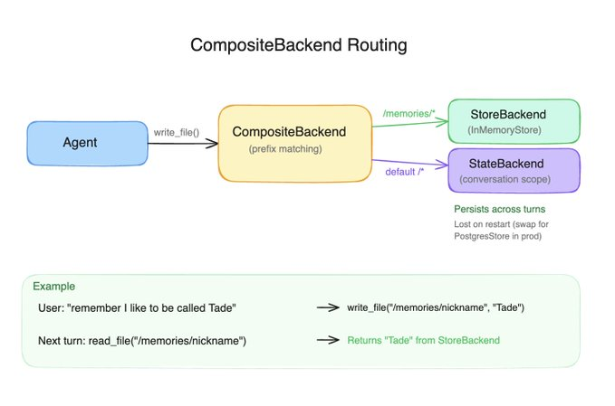

*[Originally posted on X.](https://x.com/tadeodonegana/status/2027478696286658778)*

I work as an AI Engineer at [Tiendanube](https://www.tiendanube.com/) (Nuvemshop), one of Latin America's largest e-commerce platforms. We already ship agents with LangGraph and Langchain in production, and the LangChain ecosystem is a core part of our stack.



When [Deep Agents](https://blog.langchain.com/deep-agents/) dropped, I wanted to see what it adds on top of what we already use, so i decided to build something.
I picked our own domain as the learning exercise: Tiendanube store management. Products with variants, multilingual content, orders, coupons, customers, content pages, a lot of surface area and a real test for any agent framework with harness.

> This [video](https://www.youtube.com/watch?v=TTMYJAw5tiA) is great for understanding how Deep Agents is built from scratch. Thanks, [@hwchase17](https://x.com/hwchase17)!


Here's a quick demo of the final product, and the [repo](https://github.com/tadeodonegana/nube-agent/tree/main) in case you are looking for the code:

<video controls width="100%">
  <source src="./nube-agent.mp4" type="video/mp4" />
</video>

Now let's start talking about some cool stuff i learned while building this with LangChain deepagents.

##The Harness

In LangGraph, you build a StateGraph, define nodes, wire edges, add tools via ToolNode, manage state schemas, and compose everything manually. You control every detail, but for agent patterns you end up writing the same boilerplate: the model-tools loop, conditional routing, state management, message handling.

Deep Agents' harness absorbs all of that. If you don't need the full harness, you can use the `create_agent` function from LangChain, which is a great lighter abstraction. But for what I was building, I wanted the full thing.

```py
agent = create_deep_agent(
    model="openai:gpt-4o",
    tools=[get_store_info],
    system_prompt=load_system_prompt(),
    skills=["skills/"],
    subagents=SUBAGENTS,
    backend=_make_backend,
    store=InMemoryStore(),
    checkpointer=MemorySaver(),
)
```
Instantiate this and you get a fully wired CompiledGraph with a model-tools loop, a middleware stack, a virtual filesystem routed through your backend, automatic context management, write_todos for planning, and task() for spawning ephemeral sub-agents.

## Sub-Agents

The Tiendanube admin panel is big. Products, categories, variants, images, orders, customers, coupons, abandoned checkouts, content pages, etc. Giving a single agent all 43 tools would drown it. So I split the domain into five focused sub-agents, each with its own tools, system prompt, and skills:

```py
SUBAGENTS = [
    {
        "name": "catalog-manager",
        "description": (
            "Manage the product catalog: list, view, create, update, "
            "and delete products, categories, variants, and images."
        ),
        "system_prompt": "You are the catalog manager. Prices and stock "
                         "live on VARIANTS, not products...",
        "tools": [list_products, get_product, create_product, ...],  # 21 tools
        "skills": ["skills/product-management/", "skills/category-management/"],
    },
    # order-manager (6 tools), customer-manager (4), marketing-manager (7), content-manager (5)
]
```

The key insight: each sub-agent only sees its own tools. The catalog manager doesn't know about coupons, the order manager doesn't know about products. Deep Agents handles the routing.



## Human-in-the-Loop

Store management has irreversible operations. Deleting a product, canceling an order, removing a coupon, a misunderstood prompt shouldn't wipe out a catalog. Deep Agents provides interrupt_on for exactly this, and the docs make it look simple:

```py
agent = create_deep_agent(
    ...
    interrupt_on={"delete_product": True, "cancel_order": True, ...},
)
```

I set this up, tested a delete, and... the product was gone. No interrupt. No confirmation. Silently executed.
This is because interrupt_on on the main agent does not propagate to user-defined sub-agents. It only applies to tools called directly by the main agent. My destructive tools live on domain-specific sub-agents (delete_product is on catalog-manager, for example), so the interrupt never fired.



The fix was to  declare interrupt_on inside each sub_agent, and everything worked perfectly.

When a sub-agent tries to call delete_product, the HumanInTheLoopMiddleware fires after the LLM decides to call the tool but *before* it executes. The graph pauses with interrupt(), and control returns to the CLI:



Another important thing is to key your resume payload by interrupt ID, this is useful when you can get concurrent interrupts from different agents in the same turn (subagents!). The id-keyed pattern is the only approach that handles this correctly.

## Memory

Deep Agents gives your agent a virtual filesystem: read_file, write_file, edit_file, glob, grep. These aren't real filesystem calls. They're routed through a pluggable backend, so the agent thinks it's working with files, but you control where the data actually lives.

```py
from deepagents.backends import CompositeBackend, StateBackend, StoreBackend

def _make_backend(runtime):
    return CompositeBackend(
        default=StateBackend(runtime),
        routes={"/memories/": StoreBackend(runtime)},
    )

agent = create_deep_agent(
    ...
    backend=_make_backend,  # Callable, not an instance
    store=InMemoryStore(),
)
```

The default path goes to StateBackend (conversation-scoped, great for scratch work). The /memories/ path goes to StoreBackend backed by InMemoryStore (persists across turns, lost on restart, in production something else would be needed, for example PostgresStore).



When a user says "remember that i like  to be called Tade", the agent calls write_file("/memories/nickname", "Tade")`. The CompositeBackend matches the prefix and routes it to the store. Next turn, the agent reads it back. No custom code needed.

## You don't need shell access

When I first heard about Deep Agents, I assumed shell access would be mandatory. I was building a store management tool, not a coding assistant. I didn't want my agent running arbitrary commands.
Turns out you can fully detach that. My agent has access to its sub-agents, their tools, and the virtual filesystem. Nothing else. Everything stays under control.

What actually surprised me is that performance *improved* after adding the filesystem. The agent started using it as scratch space, writing intermediate results, keeping notes, instead of trying to hold everything in context.

## Wrapping Up

Deep Agents is great. I was really excited to try it out on a real-world scenario, and after reading several posts from [@Vtrivedy10](https://x.com/Vtrivedy10), [@hwchase17](https://x.com/hwchase17), [@sydneyrunkle](https://x.com/sydneyrunkle), and [@masondrxy](https://x.com/masondrxy) I decided to give it a go.

Coming from a team that already ships LangGraph agents in production, Deep Agents impressed me with how much it absorbs. Sub-agent delegation, HITL interrupts, skills loading, context compression, virtual filesystem, memory routing. All things we've hand-built before, now set up in a single, easy-to-use abstraction. This is something great LangChain is doing, making this simpler, like the abstraction of create_agent (ex: create_react_agent).

For sure we are going to make something production ready with this, that is the next step.