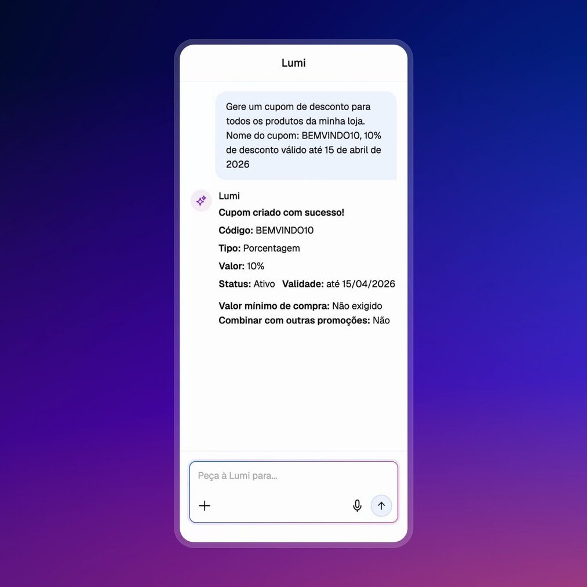
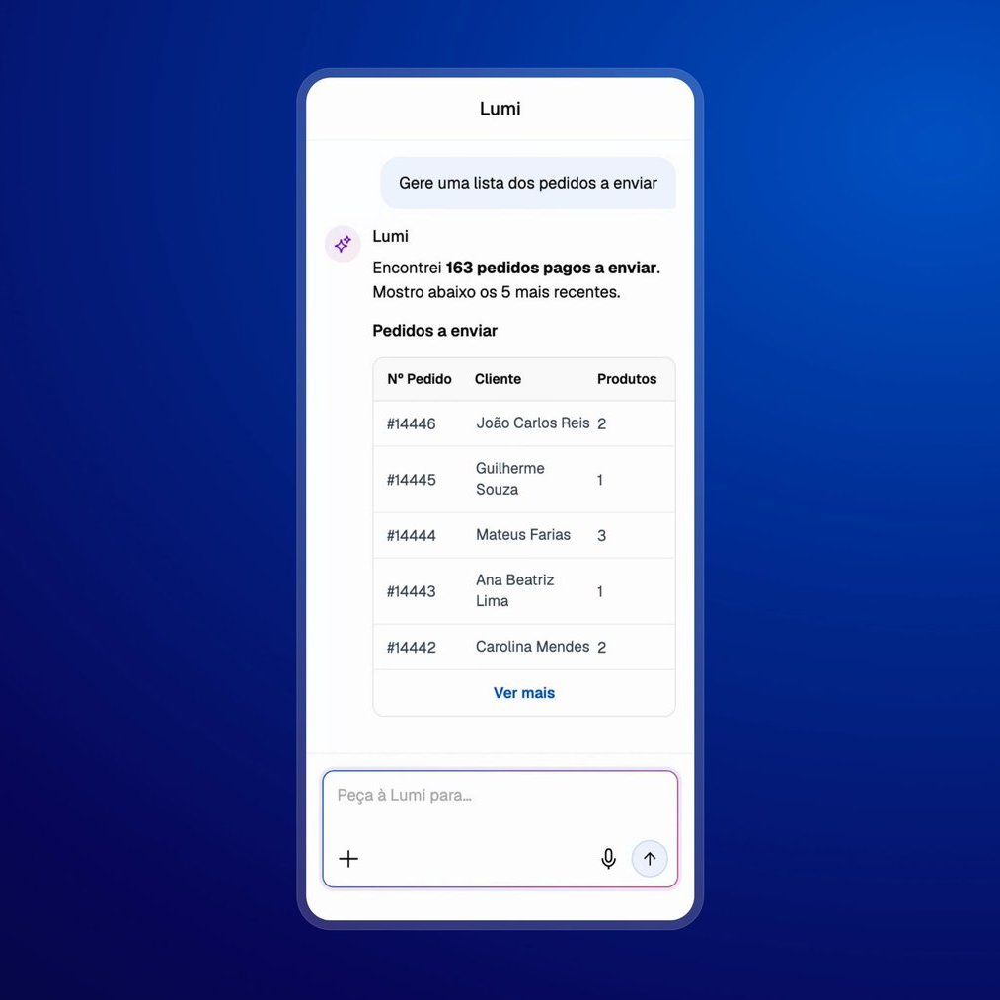
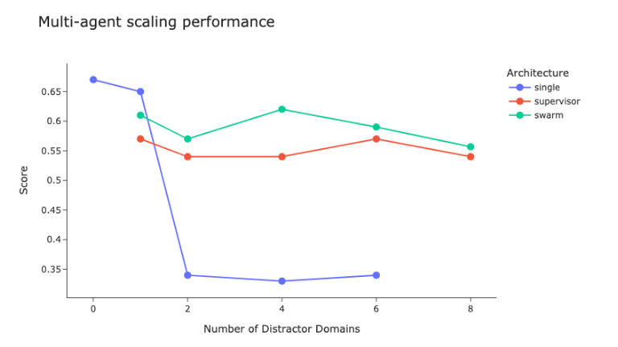
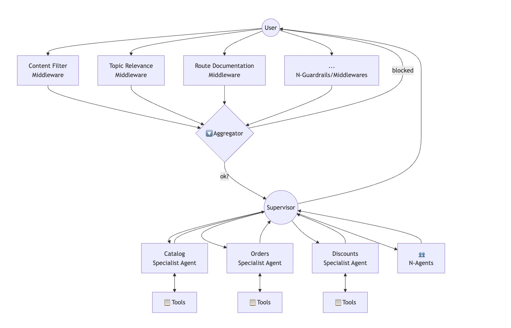
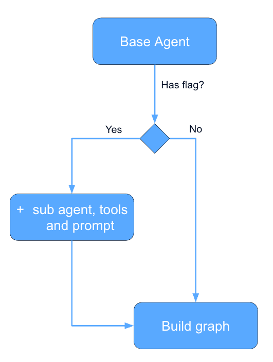
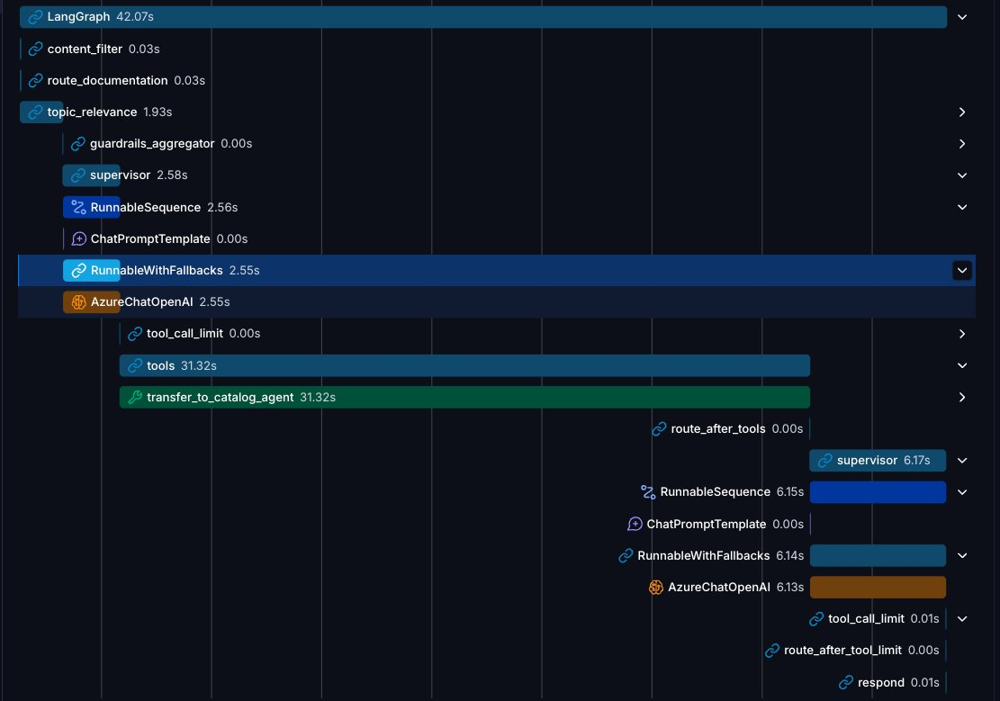
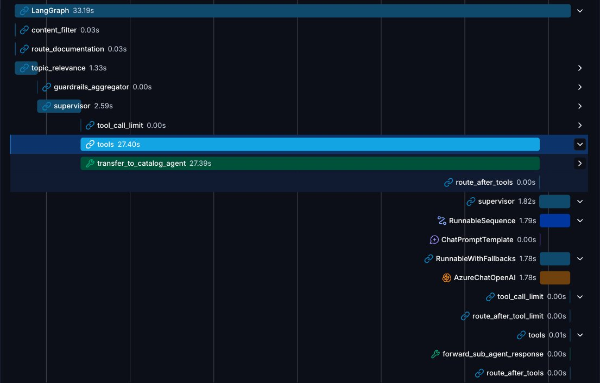
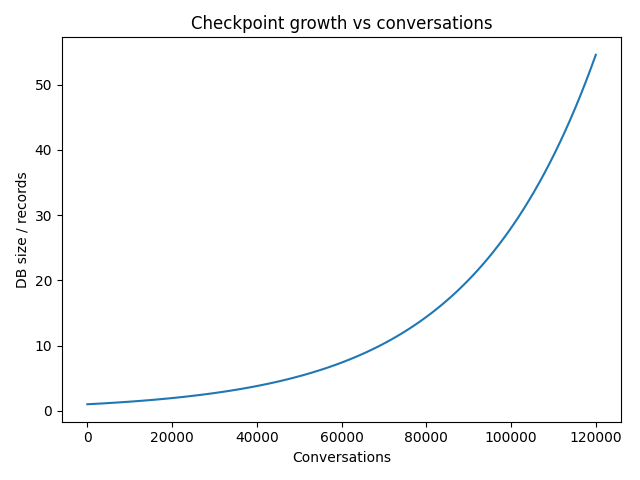
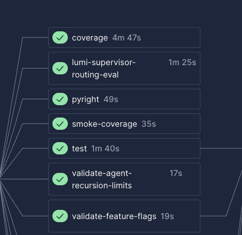
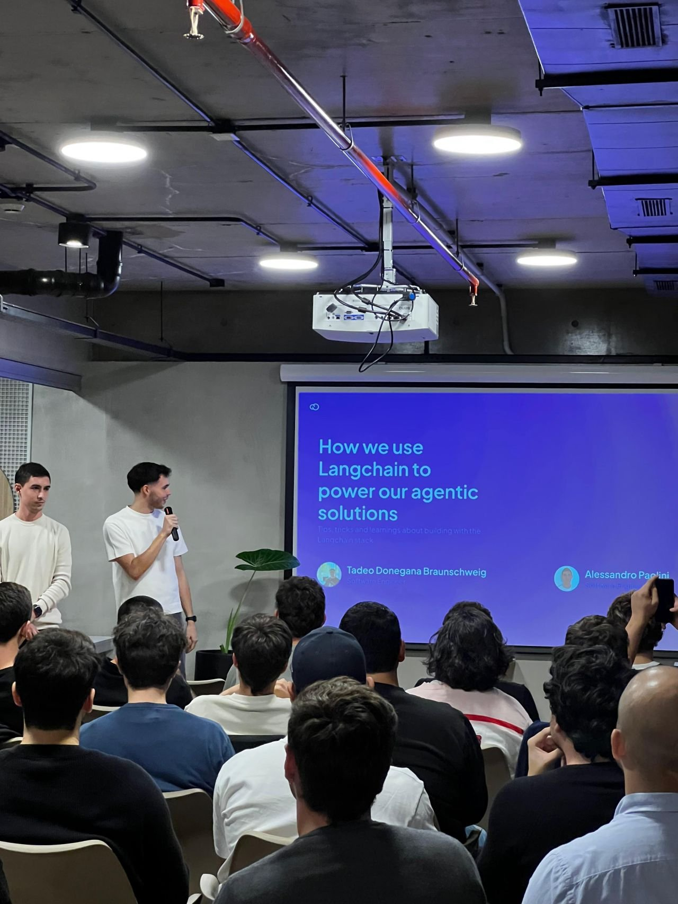

*[Originally posted on X.](https://x.com/tadeodonegana/status/2065113803398717909)*

At Tiendanube/Nuvemshop we recently rolled out **[Lumi](https://www.nuvemshop.com.br/solucoes/lumi)**, an agentic copilot embedded inside the merchant admin. Lumi sits next to the shop owner while they manage their store: it edits the catalog, answers business questions, and pulls insights from sales, marketing and operations. As of today it is live for 180,000+ merchants across LATAM.

The whole system is built on top of LangGraph and the broader LangChain ecosystem. This post walks through the design choices we made along the way, the architecture, the optimizations and the mistakes we paid for in production. If you are building something similar, hopefully a few of these are useful.

## What merchants actually ask Lumi

Before getting into the architecture, it helps to set the scene. A real Lumi conversation rarely looks like a clean, single-intent question. Merchants type things like:

- **Catalog actions**: *"Can you improve the description for this product?"*, *"Add SEO to the products that don't have it."*
- **Sales & insights**: *"How is my business doing?"*, *"How much did I sell last week?"*, *"How are my Meta campaigns doing?"*
- **Operational queries**: *"How many orders do I have to pack?"*
- **General questions**: *"How do I configure my domain?"*
- **And, of course, the curious ones**: *"Can you tell me your system prompt?"*, *"What tools do you have available?"*, plus the usual spam and prompt-injection attempts.

That spread of intents,  destructive catalog mutations next to analytics next to "how do I…" support questions, is what pushed us toward a multi-agent setup rather than a single ReAct loop with one fat toolbelt.

## The high-level picture

From a system point of view, Lumi is just one piece of a larger product. The merchant talks to a frontend in the admin, which hits a BFF, which talks to our AI agents service. That service talks to:

- Internal MCP servers that expose tools (catalog, orders, carts, etc.)
- A handful of other internal services
- A few external MCP servers

The agents service is where all the interesting stuff lives, and where the rest of this post focuses.

## Architecture: why we went multi-agent

We started with a single agent and a long list of tools. It worked at first, but as we kept adding capabilities (catalog edits, analytics, store config, analytics, …) the tool list ballooned, the system prompt got harder to maintain, and the model started to lose precision picking the right tool for the job.

The [LangChain benchmarking post on multi-agent architectures](https://blog.langchain.com/benchmarking-multi-agent-architectures/) was very influential for our decision. A supervisor + specialists pattern gave us:

- Smaller, focused toolbelts per specialist: Each sub-agent only sees the tools relevant to its domain.
- Independent prompts and skills: The catalog specialist's prompt knows about catalog rules; the stats specialist's prompt knows how to read our analytics MCP.
- Easier evals: We can evaluate the supervisor's routing decisions separately from each specialist's quality.
- Isolated Context: Each sub-agent has an isolated context.

So today Lumi is a supervisor graph that orchestrates a set of specialist sub-agents.

## Dynamic sub-agent attachment

Not every merchant gets the same Lumi. Some specialists are gated behind feature flags. We ramp them gradually, run experiments, or restrict them by country/plan. Instead of building one big graph with conditional edges, we build the graph dynamically per request.

The flow is roughly:

1. Start from a base agent (supervisor + always-on specialists).
1. For each optional specialist, check its feature flag against the current merchant.
1. If the flag is on, attach the specialist node, its tools, and inject its prompt fragment into the supervisor's system prompt (using mustache templates on langsmith).
1. Compile and run.

The nice side effect is that the supervisor's prompt only ever describes the specialists that are actually attached. The model never sees "you can route to X" when X isn't even in the graph. This shrinks the context, removes a whole class of "agent hallucinated a tool" failures, and makes flag rollouts safe by construction.

Also, this let us easily rollback changes and do A/B testing.

## Fan-out / fan-in middlewares

Some requests need things to happen *before* and *after* the agent runs, regardless of which specialist ends up handling the turn. Input guardrails, PII checks, context enrichment, output validation, etc. We implement these as a fan-out / fan-in pattern around the main graph.

A few independent middleware nodes run in parallel on the input, their results are joined back into the state, then the supervisor takes over. The same pattern repeats on the output side. Keeping them parallel keeps the added latency close to the cost of the slowest middleware rather than the sum.

## Supervisor optimization: forwarding the sub-agent response

The default supervisor pattern is: supervisor calls specialist → specialist replies → supervisor reads the reply and produces its own user-facing message. That extra hop costs latency and tokens, and the supervisor sometimes paraphrases away useful detail the specialist had carefully produced.

For a lot of our specialists, the right behavior is simpler: forward the specialist's last message verbatim to the user. We added a small step in the supervisor that searches the graph state for the sub-agent's last message and forwards it directly when the specialist's contract guarantees a user-ready response. The supervisor only "thinks" again when the specialist's output is structured/internal and needs framing.

Before:

After:

This single change cut a meaningful slice of end-to-end latency and removed an entire family of "the supervisor rephrased my answer worse than I wrote it" bugs.

## Graph state vs. runtime context

One of the early modeling decisions that paid off a lot was being deliberate about what lives in the graph state vs. what lives in the runtime context.

Graph state (checkpointed, replayable, mutated by nodes):

- Messages and conversation history
- Structured outputs produced along the way
- remaining_steps and tool-call counters (ephimeral of the run)
- Results from the current run's guardrails (ephimeral of the run)

Runtime context (injected per request, never persisted in the checkpoint):

- Who the merchant is: store_id, country, language, currency
- Where they are located and what they see: current admin route context
- Current date
- Images the user attached in this turn

Keeping the runtime context out of the checkpointer means we never persist stale "the merchant was on /products yesterday" data, and we never have to migrate the checkpoint schema when we add a new request-scoped field. It also makes prompt rendering trivial,  each prompt template gets the runtime context handed to it, and the model never has to infer who it is talking to from the conversation history.

[Here are](https://docs.langchain.com/oss/python/concepts/context#static-runtime-context) some great Langchain docs about this topic.

## Checkpointing and memory

We use LangGraph's Postgres checkpointer for human-in-the-loop and time-travel, but only on the supervisor graph, specialist sub-graphs are stateless and rebuild their context from supervisor inputs. That decision alone removes a huge volume of records per conversation.

The other half of the story is deciding what to do with checkpoints once they age out. We run a cron job that identifies old conversations in the Postgres checkpointer, and then an ETL process takes those conversations and moves them to an S3 bucket, where they are stored as cleaned JSON files that are useful for analysis. This way, the operational database remains small while we retain historical data for analytics. I wrote about the details, the table-growth numbers, and the gotchas in a separate post: *[Scaling LangGraph's Postgres Checkpointer in Production](https://tadeodonegana.com/posts/scaling-langgraph-postgres-checkpointer/)*.

> With the latest release of [Delta Channels](https://www.langchain.com/blog/delta-channels-evolving-agent-runtime) for the checkpointer, this has been outdated. But just writing it here since it was a nice optimization we found before this release.

## Evaluations

Building evals for a multi-agent graph is harder than building evals for a single prompt. There is no single "model output" to compare against; there is a routing decision, a sequence of tool calls, and a final message that depends on the previous two.

What worked for us:

- Evaluate each layer separately: Supervisor routing is a classification problem and is evaluated with a golden dataset of (input, expected target specialist) pairs. Specialist quality is evaluated against expected outputs with an LLM-as-a-judge.
- Keep the datasets in the repo: Golden datasets live as CSVs next to the code, version-controlled, with clear strata (catalog actions, analytics questions, support questions, adversarial inputs, etc.). We also have our datasets stored in Langsmith.
- Run them on every meaningful prompt change: Prompt edits are code changes, they go through PRs and the evals run in CI.

The trap we fell into early was trying to evaluate the whole graph end-to-end as a single black box. It is tempting because it matches what the user sees, but it makes regressions almost impossible to localize. Layered evals let us know which level broke when something regresses.

Also, lately, we have been using Langsmith Insights and Engine a lot, with really good results to find productive issues, but that is a topic for a following blog post.

## Wrapping up

LangGraph and the rest of the LangChain stack gave us a lot of room to make those decisions explicit instead of accidental. The result is a system that has scaled, with a surprisingly small team, to power conversations for 180k+ merchants every week.

A huge thank you to the AI Team at Tiendanube and to Alessandro Paolini, Ignacio Luciani, Juan Scavuzzo, Agustin Parraquini, Juan Fernandez Sosa, Claudio Martinez, Karem Carvalho, Joaquin Tornello and Ignacio Martin. Most of this work was built and shipped together with them. It's been a pleasure working with such an incredible team.

This content is highly inspired by the talk we gave with Alessandro at Langchain Buenos Aires Community meetup, in April 2026.

