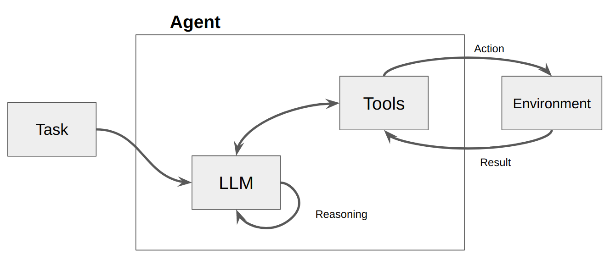

## Introduction

Agents are trending right now, but before all the hype, they had humble beginnings. The **ReAct framework** is one of the earliest agentic approaches introduced in the literature. It combines **reasoning** (the thought process) and **action-taking** (executing specific functions) within an LLM to handle multifaceted tasks. This synergy enables LLMs to generate reasoning traces and task-specific actions, maintain and update action plans, handle exceptions, and interact with external sources for additional information.

## Overview

In the original paper[^1], the authors presented the idea of synergizing reasoning and action-taking in language models, making them more capable of handling several tasks.

ReAct is inspired by the human ability to learn and make decisions by combining acting and reasoning.

With this framework, you can implement additional actions that an LLM can take, such as running calculations or searching for specific information in a database, then teach it how to request that those actions are run, and finally feed the results back into the LLM.



<div style="text-align: center;">
This diagram illustrates the interaction between the Agent, LLM, Tools, and the Environment in the ReAct framework.
</div>

## Quick Example

Let's see a quick example of how this model works before moving into the Python implementation. Suppose we have a function called `calculate`, which will be our action:

```py
def calculate(what):
    return eval(what)
```

If we query the model, using the ReAct framework, with the following:

```py
query("Fifteen * twenty five")
```

The **behavior, reasoning, and action** of the agent will be something like this:

```
Thought: The action required is a calculation
Action: calculate: 15 * 25
PAUSE
 -- running calculate 15 * 25
Observation: 375
Answer: Fifteen times twenty five equals 375.
```

Returning the correct answer.

## Implementation from Scratch

Now, let's dive deeper into how to implement this model from scratch using pure Python. Just as a disclaimer, _this is not a very robust implementation_, but it is a useful way to explain how the framework works at a low level.

1. Defining the Agent Class

The Agent class manages the three main responsibilities of an agent: **capturing user messages, processing them, and producing answers**.

```py
class Agent:
    def __init__(self, system=""):
        self.system = system
        self.messages = []
        if self.system:
            self.messages.append({"role": "system", "content": system})

    def __call__(self, message):
        self.messages.append({"role": "user", "content": message})
        result = self.execute()
        self.messages.append({"role": "assistant", "content": result})
        return result

    def execute(self):
        completion = client.chat.completions.create(
            model="gpt-4o",
            temperature=0,
            messages=self.messages
        )
        return completion.choices[0].message.content
```

2. Constructing the Main Prompt

We will have two available actions for the model: `calculate` and `get_country_capitals`. In the master prompt, we include a few-shot prompt to teach the model how to act:

```py
prompt = """
You run in a loop of Thought, Action, PAUSE, Observation.
At the end of the loop you output an Answer
Use Thought to describe your thoughts about the question you have been asked.
Use Action to run one of the actions available to you - then return PAUSE.
Observation will be the result of running those actions.

Your available actions are:

calculate:
e.g. calculate: 4 * 7 / 3
Runs a calculation and returns the number - uses Python so be sure to use floating point syntax if necessary

get_country_capitals:
e.g. get_country_capitals: Argentina
returns the capital when given the country name

Example session:

Question: What's is the capital of Argentina?
Thought: I should look the country capitals using get_country_capitals
Action: get_country_capitals: Argentina
PAUSE

You will be called again with this:

Observation: Buenos Aires

You then output:

Answer: The capital of Argentina is Buenos Aires
""".strip()
```

3. Defining the Actions

Next, we define the functions (tools) that the model can use:

```py
def calculate(what):
    return eval(what)

def get_country_capitals(country):
    if country in "Argentina":
        return "Buenos Aires"
    elif country in "Spain":
        return "Madrid"
    elif country in "United States":
        return "Washington D. C."

known_actions = {
    "calculate": calculate,
    "get_country_capitals": get_country_capitals
}
```

4. Querying the Agent

Let's create an agent and see how the thought and action steps work:

```py
agentOne = Agent(prompt)

result = agentOne("What's the capital of Argentina?")
print(result)
```

Output:

```
Thought: I should look up the capital of Argentina using get_country_capitals.
Action: get_country_capitals: Argentina
```

We can also check the messages attribute to see the entire content that is being sent to the LLM:

```py
agentOne.messages
```

Output _(simplified)_:

```
[{'role': 'system',  'content': "You run in a loop of Thought, Action, PAUSE, Observation..."}, {'role': 'user', 'content': "What's the capital of Argentina?"}, {'role': 'assistant',  'content': 'Thought: I should look up the capital of Argentina using get_country_capitals.\nAction: get_country_capitals: Argentina'}]
```

5. Completing the ReAct Loop

This is where the core part of the ReAct agent framework comes into play. We will define a loop that **checks if the output contains an action**. If it does, the loop calls the relevant function, appends the observation to the conversation, and allows the model to produce the final response.

```py
action_re = re.compile('^Action: (\w+): (.*)$')

def query(question, max_turns=5):
    i = 0
    bot = Agent(prompt)
    next_prompt = question
    while i < max_turns:
        i += 1
        result = bot(next_prompt)
        print(result)
        actions = [
            action_re.match(a)
            for a in result.split('\n')
            if action_re.match(a)
        ]
        if actions:
            # There is an action to run
            action, action_input = actions[0].groups()
            if action not in known_actions:
                raise Exception("Unknown action: {}: {}".format(action, action_input))
            print(" -- running {} {}".format(action, action_input))
            observation = known_actions[action](action_input)
            print("Observation:", observation)
            next_prompt = "Observation: {}".format(observation)
        else:
            return
```

6. Testing the Agent

Now, if we query the agent, the entire agentic flow should be completed:

```py
question = "What's the capital of spain?"
query(question)
```

Output:

```
Thought: I should look up the capital of Spain using get_country_capitals.
Action: get_country_capitals: Spain
PAUSE
 -- running get_country_capitals Spain
Observation: Madrid
Answer: The capital of Spain is Madrid.
```

Another example:

```py
question = "How much is two plus two and the result divided by two?"
query(question)
```

Output:

```
Thought: I need to calculate the sum of two plus two and then divide the result by two.
Action: calculate: (2 + 2) / 2
PAUSE
 -- running calculate (2 + 2) / 2
Observation: 2.0
Answer: Two plus two, divided by two, equals 2.0.
```

This is a simple, step-by-step implementation of the ReAct agent model in Python from scratch. In real-world scenarios, it is recommended to use more robust implementations, such as **LangChain's ReAct version**[^2].

The **full code** can be found on this [Google Colab](https://colab.research.google.com/drive/1-ahi8kZN12l7_Xs2YiwWeGKhMgFSF1uP?usp=sharing).

This post was inspired by the following resources:

1. A simple Python implementation of the ReAct pattern for LLMs[^3].
2. DeepLearning.ai AI Agents in LangGraph course[^4].

Special thanks to my friend _J. Gavernet_ for providing a thorough review of this post.

[^1]: [ReAct: Synergizing Reasoning and Acting in Language Models](https://arxiv.org/pdf/2210.03629)
[^2]: [ReAct: Langchain documentation](https://python.langchain.com/v0.1/docs/modules/agents/agent_types/react/)
[^3]: [A simple Python implementation of the ReAct pattern for LLMs](https://til.simonwillison.net/llms/python-react-pattern)
[^4]: [DeepLearning.ai AI Agents in LangGraph](https://learn.deeplearning.ai/courses/ai-agents-in-langgraph/lesson/3/langgraph-components)
